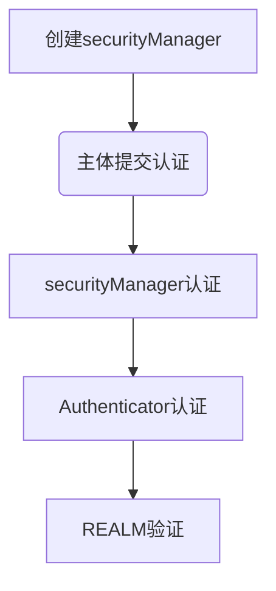
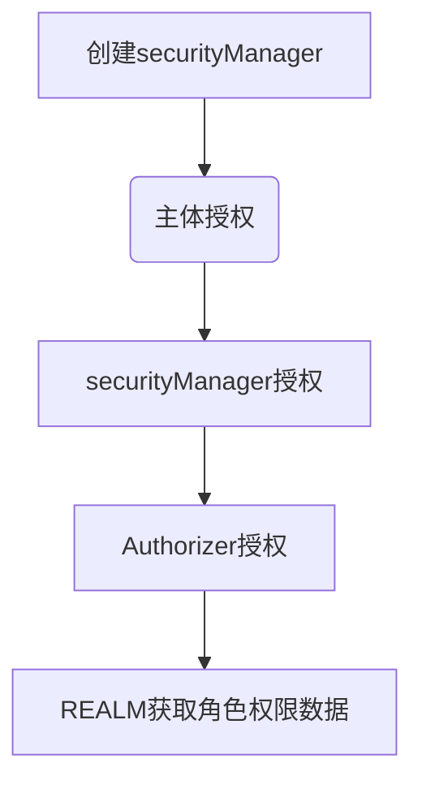

### shiro安全框架

掌握：[官方文档](http://shiro.apache.org/architecture.html) 

认识shiro整体架构，各组件概念

shiro认证及授权过程

shiro自定义的Realm，filter

shiro session管理（使用redis实现分布式session）

shiro 缓存管理 （角色数据和权限数据）

shiro在项目中使用，集成spring

#### 1. 什么是shiro

+ Apache的强大灵活的开源安全框架
+ （可以提供）认证、授权 、企业会话管理 、缓存 、安全加密 --》快捷方便实现项目的权限管理模块开发

#### 2. shiro与spring security比较

| Apache shiro     | spring security  |
| ---------------- | ---------------- |
| 简单 灵活        | 复杂 笨重        |
| 可脱离spring     | 不可脱离spring   |
| 权限控制粒度较粗 | 权限控制粒度更细 |

一般做权限控制基本上是对资源做权限控制，

对数据做权限控制会造成跟业务代码耦合。

spring官方也是使用shiro做安全管理。

#### 3. shiro整体架构

At the highest conceptual level, Shiro’s architecture has 3 primary concepts: 

the `Subject`, `SecurityManager` and `Realms`. 

The following diagram is a high-level overview of how these components interact, and we’ll cover each concept below:


The following diagram shows Shiro’s core architectural concepts followed by short summaries of each:


**Subject** ([`org.apache.shiro.subject.Subject`](http://shiro.apache.org/static/current/apidocs/org/apache/shiro/subject/Subject.html)) --》相当于当前user

**SecurityManager** ([org.apache.shiro.mgt.SecurityManager](http://shiro.apache.org/static/current/apidocs/org/apache/shiro/mgt/SecurityManager.html)) --》the heart of Shiro’s architecture 核心

**Authenticator** ([org.apache.shiro.authc.Authenticator](http://shiro.apache.org/static/current/apidocs/org/apache/shiro/authc/Authenticator.html)) 认证器 （管理登录，登出）

**Authorizer** ([org.apache.shiro.authz.Authorizer](http://shiro.apache.org/static/current/apidocs/org/apache/shiro/authz/Authorizer.html)) 授权器 （赋予主体有哪些权限）

**SessionManager** ([org.apache.shiro.session.mgt.SessionManager](http://shiro.apache.org/static/current/apidocs/org/apache/shiro/session/mgt/SessionManager.html)) session管理器 （shiro自己实现的   	

​		session 管理机制）

+ **SessionDAO** ([org.apache.shiro.session.mgt.eis.SessionDAO](http://shiro.apache.org/static/current/apidocs/org/apache/shiro/session/mgt/eis/SessionDAO.html))  提供session的操作，实现session持久化操作 crud

**CacheManager** ([org.apache.shiro.cache.CacheManager](http://shiro.apache.org/static/current/apidocs/org/apache/shiro/cache/CacheManager.html)) 缓存管理器 （缓存角色数据和权限数据）

**Cryptography** ([org.apache.shiro.crypto.*](http://shiro.apache.org/static/current/apidocs/org/apache/shiro/crypto/package-summary.html))  数据加密

**Realms** ([org.apache.shiro.realm.Realm](http://shiro.apache.org/static/current/apidocs/org/apache/shiro/realm/Realm.html)) --》相当于shiro与数据源（DB）的桥梁

+ Realms act as the ‘bridge’ or ‘connector’ between Shiro and your application’s security data

#### 4. shiro认证过程



​	

#### 5. shiro授权过程




#### 6. shiro自定义realm

##### 6.1 内置realm

+ IniRealm

```java
public class IniRealmTest {

    @Test
    public void auth(){

        // 1 构建securityManager环境
        DefaultSecurityManager defaultSecurityManager = new DefaultSecurityManager();

        IniRealm iniRealm = new IniRealm("classpath:user.ini");

        defaultSecurityManager.setRealm(iniRealm);

        // 2 主体提交认证请求
        SecurityUtils.setSecurityManager(defaultSecurityManager);
        Subject subject = SecurityUtils.getSubject();

        UsernamePasswordToken token = new UsernamePasswordToken("xingfei", "123456");

        subject.login(token);

        System.out.println("isAuthenticated:" + subject.isAuthenticated());

        subject.checkRoles("admin");

        subject.checkPermissions("user:delete","user:update","user:add");
    }
}
```


+ JdbcRealm


```java
public class JdbcRealmTest {

    private DruidDataSource dataSource = new DruidDataSource();

    {
        dataSource.setUrl("jdbc:mysql://localhost:3306/test");
        dataSource.setUsername("root");
        dataSource.setPassword("123456");
    }

    @Test
    public void auth(){

        // 1 构建securityManager环境
        DefaultSecurityManager defaultSecurityManager = new DefaultSecurityManager();

        JdbcRealm realm = new JdbcRealm();

        realm.setDataSource(dataSource);

        String authenticationSql = "select password from dh_user where username = ?";
        realm.setAuthenticationQuery(authenticationSql);

        String roleSql = "select rolename from dh_user_role where username = ?";
        realm.setUserRolesQuery(roleSql);

        String permissionSql = "select permission from dh_role_permission where rolename = ?";
        realm.setPermissionsQuery(permissionSql);

        //默认false未开启权限查找开关
        realm.setPermissionsLookupEnabled(true);

        defaultSecurityManager.setRealm(realm);

        // 2 主体提交认证请求
        SecurityUtils.setSecurityManager(defaultSecurityManager);
        Subject subject = SecurityUtils.getSubject();

        UsernamePasswordToken token = new UsernamePasswordToken("xingfei", "123456");

        subject.login(token);

        System.out.println("isAuthenticated:" + subject.isAuthenticated());

        subject.checkRoles("admin");

        subject.checkPermissions("user:delete","user:update");

    }
}
```


##### 6.2 自定义realm

+ 继承AuthorizingRealm
+ 认证 doGetAuthenticationInfo
+ 授权 doGetAuthorizationInfo


```java
public class CustomRealm extends AuthorizingRealm {

    Map<String, String> userMap = new HashMap<String, String>(16);

    Set<String> roleSet = new HashSet<String>();

    Set<String> permissionSet = new HashSet<String>();

    {
        userMap.put("xingfei", "123456");
        super.setName("customRealm");
    }

    {
        roleSet.add("admin");
        roleSet.add("user");
    }

    {
        permissionSet.add("user:update");
        permissionSet.add("user:delete");
    }


    protected AuthorizationInfo doGetAuthorizationInfo(PrincipalCollection principalCollection) {
        String userName = (String) principalCollection.getPrimaryPrincipal();
        Set<String> roles = getRolesByUserName(userName);
        Set<String> permissions = getPermissionsByUserName(userName);
        SimpleAuthorizationInfo authorizationInfo = new SimpleAuthorizationInfo();
        authorizationInfo.setRoles(roles);
        authorizationInfo.setStringPermissions(permissions);
        return authorizationInfo;
    }


    /**
     * 模拟从数据库或缓存中获取角色数据
     * @param userName
     * @return
     */
    private Set<String> getRolesByUserName(String userName) {
        return roleSet;
    }

    /**
     * 模拟从数据库或缓存中获取权限数据
     * @param userName
     * @return
     */
    private Set<String> getPermissionsByUserName(String userName) {
        return permissionSet;
    }


    protected AuthenticationInfo doGetAuthenticationInfo(AuthenticationToken authenticationToken) throws
            AuthenticationException {
        //1 从主体传过来的认证信息中，获取用户名
        String userName = (String) authenticationToken.getPrincipal();

        //2 通过用户名到数据库中获取凭证
        String password = getPasswordByUserName(userName);

        if (StringUtils.isBlank(password)) {
            return null;
        }

        SimpleAuthenticationInfo authenticationInfo = new SimpleAuthenticationInfo(
                userName, password, "customRealm");

        return authenticationInfo;
    }

    /**
     * 模拟从数据库或缓存中获取凭证
     *
     * @param userName
     * @return
     */
    private String getPasswordByUserName(String userName) {
        return userMap.get(userName);
    }
}
```

```java
public class CustomRealmTest {
    
    @Test
    public void authentication(){
        // 1 构建securityManager环境
        DefaultSecurityManager defaultSecurityManager = new DefaultSecurityManager();

        CustomRealm realm = new CustomRealm();

        defaultSecurityManager.setRealm(realm);

        // 2 主体提交认证请求
        SecurityUtils.setSecurityManager(defaultSecurityManager);
        Subject subject = SecurityUtils.getSubject();

        UsernamePasswordToken token = new UsernamePasswordToken("xingfei", "123456");

        subject.login(token);

        System.out.println("isAuthenticated:" + subject.isAuthenticated());

        subject.checkRoles("admin");

        subject.checkPermissions("user:update");
        
    }
}
```


#### 7. shiro加密

数据库中存储的一般都是密文。

+ shiro散列配置
  + HashedCredentialsMatcher工具
  + 自定义Realm中使用散列
  + 盐的使用 （一般随机数）

```java
public class EncryptWithSaltTest {

    @Test
    public void authentication(){
        // 1 构建securityManager环境
        DefaultSecurityManager defaultSecurityManager = new DefaultSecurityManager();

        CustomRealm realm = new CustomRealm();

        HashedCredentialsMatcher matcher = new HashedCredentialsMatcher();
        //算法名
        matcher.setHashAlgorithmName("md5");
        //加密次数
        matcher.setHashIterations(1);

        realm.setCredentialsMatcher(matcher);

        defaultSecurityManager.setRealm(realm);

        // 2 主体提交认证请求
        SecurityUtils.setSecurityManager(defaultSecurityManager);
        Subject subject = SecurityUtils.getSubject();

        UsernamePasswordToken token = new UsernamePasswordToken("xingfei", "123456");

        subject.login(token);

        System.out.println("isAuthenticated:" + subject.isAuthenticated());
    }
}
```


com.leh.shiro.realm.CustomRealm#doGetAuthenticationInfo

```java
protected AuthenticationInfo doGetAuthenticationInfo(AuthenticationToken authenticationToken) throws
        AuthenticationException {
    //1 从主体传过来的认证信息中，获取用户名
    String userName = (String) authenticationToken.getPrincipal();

    //2 通过用户名到数据库中获取凭证
    String password = getPasswordByUserName(userName);

    if (StringUtils.isBlank(password)) {
        return null;
    }

    SimpleAuthenticationInfo authenticationInfo = new SimpleAuthenticationInfo(
            userName, password, "customRealm");
    
    //设置校验凭证用到的盐
    authenticationInfo.setCredentialsSalt(ByteSource.Util.bytes(SALT));
    
    return authenticationInfo;
}
```


#### 8. shiro继承spring

+  新建模块 shiro-web，引入所需jar包（spring、shiro、springmvc、spring-shiro、shiro-web）

+ 创建web.xml

  + 配置`context-param`

    + ```xml
      <context-param>
          <param-name>contextConfigLocation</param-name>
          <param-value>classpath*:spring/spring.xml</param-value>
      </context-param>
      ```

  + 配置ContextLoaderListener监听器

    + ```xml
      <listener>
          <listener-class>
          	org.springframework.web.context.ContextLoaderListener
          </listener-class>
      </listener>
      ```

  + 配置 DispatcherServlet 

    + ```xml
      <!--Spring MVC控制器的核心调度器-->
      <servlet>
          <servlet-name>springMvc</servlet-name>
          <servlet-class>org.springframework.web.servlet.DispatcherServlet</servlet-class>
          <init-param>
              <param-name>contextConfigLocation</param-name>
              <param-value>classpath*:spring/spring-mvc.xml</param-value>
          </init-param>
          <load-on-startup>1</load-on-startup>
      </servlet>
      
      <servlet-mapping>
          <servlet-name>springMvc</servlet-name>
          <url-pattern>/</url-pattern>
      </servlet-mapping>
      ```

  + 配置过滤器进行统一编码处理

    + ```xml
      <filter>
          <filter-name>encodingFilter</filter-name>
          <filter-class>org.springframework.web.filter.CharacterEncodingFilter</filter-class>
          <init-param>
              <param-name>encoding</param-name>
              <param-value>UTF-8</param-value>
          </init-param>
          <init-param>  <!--强制使用Encoding设置的编码格式-->
              <param-name>forceEncoding</param-name>
              <param-value>true</param-value>
          </init-param>
      </filter>
      <filter-mapping>
          <filter-name>encodingFilter</filter-name>
          <url-pattern>/*</url-pattern>
      </filter-mapping>
      ```

    

+ 创建springmvc.xml(配置上下文扫描，配置mvc的处理器适配器、处理器适配器，配置静态文件扫描)

  [springmvc配置详解](https://www.jianshu.com/p/4e8ef1fcb3d9) 

  + 配置扫描的包路径

    + ```xml
      <context:component-scan base-package="com.leh.controller"/>
      ```

  + 开启注解驱动：注册RequestMappingHandlerMapping与RequestMappingHandlerAdapter两个Bean

    + ```xml
      <mvc:annotation-driven/>
      ```

  + 静态资源处理

    + ```xml
      <mvc:resources mapping="/**" location="/" cache-period="31536000"/>
      ```

+ 创建spring.xml

  + 定义shiroFilter

    + ```xml
      <bean id="shiroFilter" class="org.apache.shiro.spring.web.ShiroFilterFactoryBean">
          <property name="securityManager" ref="securityManager"/>
          <property name="loginUrl" value="login.html"/>
          <property name="unauthorizedUrl" value="403.html"/>
          <!--shiro内置的过滤器链-->
          <property name="filterChainDefinitions">
              <!--过滤器链是有顺序的，按照从上到下的顺序进行匹配，匹配到之后直接返回 一般 /* 置于最下面-->
              <value>
                  <!--不需要任何认证，直接可以访问相应的路径-->
                  /login.html = anon
                  <!--提交登录请求的url也不需要认证-->
                  /subLogin = anon
                  <!--所有的请求，都需要经过认证之后才可以访问相应的路径-->
                  /* = authc
              </value>
          </property>
      </bean>
      ```

  + 构建shiro需要的对象 SecurityManager

    + ```xml
      <bean id="securityManager" class="org.apache.shiro.web.mgt.DefaultWebSecurityManager">
          <property name="realm" ref="customRealm"/>
      </bean>
      ```

  + 创建自定义Realm

    + ```xml
      <bean id="customRealm" class="com.leh.shiro.realm.CustomRealm">
          <property name="credentialsMatcher" ref="credentialsMatcher"/>
      </bean>
      ```

  + 创建加密管理器对象

    + ```xml
      <bean class="org.apache.shiro.authc.credential.HashedCredentialsMatcher" id="credentialsMatcher">
          <property name="hashAlgorithmName" value="md5"/>
          <property name="hashIterations" value="1"/>
      </bean>
      ```

+ 创建login.html （表单账号、密码提交到UserController）

+ 创建UserController（接受前台数据，进行shiro登录验证，如果成功返回成功，打印错误） 

#### 9. shiro集成spring-使用spring-jdbc从数据库中获取数据

+ 引入mysql、druid、spring-jdbc的jar
+ 创建spring-dao.xml，用来创建数据源和JdbcTemplate
+ 启动时加载的是spring.xml,需要在spring.xml中引入spring-dao.xml并设置扫描路径
+ 创建com.leh.dao包及dao实现包com.leh.dao.impl,存放操作数据库的dao
+ 替换原来的获取凭证和角色及权限的方法为从数据库中获取


#### 10. shiro通过注解授权

+ 添加依赖

  ```xml
  <dependency>
      <groupId>org.aspectj</groupId>
      <artifactId>aspectjweaver</artifactId>
      <version>1.8.13</version>
  </dependency>
  ```


+ 添加配置spring/spring-mvc.xml

  + ```xml
    <!--开启aop-->
    <aop:config proxy-target-class="true"/>
    
    <!--shiro 注解方式授权配置-->
    <bean class="org.apache.shiro.spring.LifecycleBeanPostProcessor" id="beanPostProcessor"/>
    <bean class="org.apache.shiro.spring.security.interceptor.AuthorizationAttributeSourceAdvisor">
        <property name="securityManager" ref="securityManager"/>
    </bean>
    ```

+ 测试 （当前主体具备括号中的角色或权限的时候才可以访问相应的方法）

  + ```java
    @RequiresRoles("admin")
    @RequestMapping(value = "testRole", method = RequestMethod.GET)
    @ResponseBody
    public String testRole(User user){
        return "用户：" + user.getUserName() + ",有admin角色";
    }
    
    @RequiresPermissions("user:delete")
    @RequestMapping(value = "testPemission", method = RequestMethod.GET)
    @ResponseBody
    public String testPemission(User user){
        return "用户：" + user.getUserName() + ",有删除用户权限";
    }
    ```


#### 11. shiro过滤器

+ 11.1 shiro内置过滤器

  + 认证相关的过滤器

    + anon  不需要任何认证，可以直接访问
    + authBasic  HTTP
    + authc  需要认证之后才可以访问
    + user  需要当前存在用户才可以进行访问
    + logout 退出

  + 授权相关的过滤器

    + perms 后面加个中括号[] ，在里面加参数，需要具备一些相关权限才可以访问
    + roles 跟perms差不多，需要包含一定角色才可以进行访问
    + ssl 要求是安全的协议（HTTPS）
    + port 要求端口是中括号内的参数

  + 测试

    + ```java
      @Controller
      public class UserController {
          ...
              
          @RequestMapping(value = "testRole", method = RequestMethod.GET)
          @ResponseBody
          public String testRole(User user){
              return "testRole OK";
          }
      
      
          @RequestMapping(value = "testRole1", method = RequestMethod.GET)
          @ResponseBody
          public String testRole1(User user){
              return "testRole1 OK";
          }
      
          @RequestMapping(value = "testPerm", method = RequestMethod.GET)
          @ResponseBody
          public String testPerm(User user){
              return "testPerm OK";
          }
      
          @RequestMapping(value = "testPerm1", method = RequestMethod.GET)
          @ResponseBody
          public String testPerm1(User user){
              return "testPerm1 OK";
          }
      	
      }
      ```

    + spring/spring.xml 配置

    ```xml
    <bean id="shiroFilter" class="org.apache.shiro.spring.web.ShiroFilterFactoryBean">
        <property name="securityManager" ref="securityManager"/>
        <property name="loginUrl" value="login.html"/>
        <property name="unauthorizedUrl" value="403.html"/>
        <!--shiro内置的过滤器链-->
        <property name="filterChainDefinitions">
            <value>
                /login.html = anon
                /subLogin = anon
    
                <!--测试内置的filter-->
    
                /testRole=roles["admin"]
                <!--当前用户同时具备admin，admin1角色才能访问 /testRole1-->
                /testRole1=roles["admin","admin1"]
                /testPerm=perms["user:update"]
                <!--当前用户同时具备 user:update,user:delete,user:add 权限才能访问  				/testPerm1-->
                /testPerm1=perms["user:update","user:delete","user:add"]
    
                <!--测试内置的filter-->
    
                /* = authc
            </value>
        </property>
    </bean>
    ```

+ 11.2 自定义filter

  + 跟认证相关的 须继承 org.apache.shiro.web.filter.authc.AuthenticatingFilter

  + 跟授权相关的 须继承 org.apache.shiro.web.filter.authz.AuthorizationFilter

    + ```java
      /*
      	实现：当前用户具备配置roles[]中的任意一个角色，即可访问相应的方法
      */
      public class RolesOrFilter extends AuthorizationFilter {
      
          @Override
          protected boolean isAccessAllowed(ServletRequest servletRequest, ServletResponse
                  servletResponse, Object o) throws Exception {
              Subject subject = getSubject(servletRequest, servletResponse);
      
              String[] roles = (String[]) o;
      
              if (roles == null || roles.length == 0) {
                  return false;
              }
      
              for (int i = 0; i < roles.length; i++) {
                  if (subject.hasRole(roles[i])) {
                      return true;
                  }
              }
              return false;
          }
      }
      ```

    + 将自定义的filter交给spring容器管理

      + spring/spring.xml

    ```xml
    <bean id="shiroFilter" class="org.apache.shiro.spring.web.ShiroFilterFactoryBean">
        <property name="securityManager" ref="securityManager"/>
        <property name="loginUrl" value="login.html"/>
        <property name="unauthorizedUrl" value="403.html"/>
        <property name="filterChainDefinitions">
            <value>
                /login.html = anon
                /subLogin = anon
    
                /testRole=roles["admin"]
                /testRole1=roles["admin","admin1"]
                /testPerm=perms["user:update"]
                /testPerm1=perms["user:update","user:delete","user:add"]
    
    
                <!-- ***********************测试自定义filter ***********************-->
    
                /testCustomRole=rolesOr["admin","admin1"]
    
                <!--***********************测试自定义filter ***********************-->
    
                /* = authc
            </value>
        </property>
    
        <!--配置自定义filter-->
        <property name="filters">
            <util:map>
                <entry key="rolesOr" value-ref="rolesOrFilter"/>
            </util:map>
        </property>
    </bean>
    
    <!--配置自定义的filter-->
    <bean class="com.leh.shiro.filter.RolesOrFilter" id="rolesOrFilter"/>
    ```

    + com.leh.controller.UserController

      ```java
      /**
       * 测试自定义的filter
       * @param user
       * @return
       */
      @RequestMapping(value = "testCustomRole", method = RequestMethod.GET)
      @ResponseBody
      public String testCustomRole(User user){
          return "testCustomRole OK";
      }
      ```

  #### 12. shiro 会话管理

  + shiro session 管理 ：shiro自己实现了一套session管理机制，可以不借助任何web容器或servlet容器的情况下使用session。

    + SessionManager、sessionDAO（session的CRUD）
    + Redis实现session共享
    + Redis实现session共享可能存在的问题

  + 代码演示  自己实现session的增删改查操作

    + 添加redis客户端访问工具 jedis
  
      ```xml
    <dependency>
          <groupId>redis.clients</groupId>
          <artifactId>jedis</artifactId>
          <version>2.9.0</version>
      </dependency>
      ```
    
    
    
    + 通过redis实现session共享，主要是重写CRUD操作的方法，需要定义自己的一套RedisSessionDao
    
      + ```java
        public class RedisSessionDao extends AbstractSessionDAO {
        }
        ```
    
    + 创建redis访问工具 JedisUtil
    
      + 通过JedisPool -  jedis连接池获取连接
    
      + 创建redis相关的配置文件 spring-redis.xml。用来配置redis相关的对象
    
         如 JedisPool
    
        spring/spring-redis.xml
    
      ```xml
      <?xml version="1.0" encoding="UTF-8"?>
      <beans xmlns="http://www.springframework.org/schema/beans"
             xmlns:xsi="http://www.w3.org/2001/XMLSchema-instance"
             xsi:schemaLocation="http://www.springframework.org/schema/beans http://www.springframework.org/schema/beans/spring-beans.xsd">
      
          <bean class="redis.clients.jedis.JedisPool" id="jedisPool">
              <constructor-arg ref="jedisPoolConfig"/>
              <constructor-arg name="host" value="127.0.0.1"/>
              <constructor-arg name="port" value="6379"/>
          </bean>
      
          <bean class="redis.clients.jedis.JedisPoolConfig" id="jedisPoolConfig"/>
      </beans>
      ```
    
      
    
    + 在SecurityManager中配置sessionManager, 配置定义的RedisSessionDao
    
      ```xml
      <!--构建shiro需要的对象 SecurityManager-->
      <bean id="securityManager" class="org.apache.shiro.web.mgt.DefaultWebSecurityManager">
          <property name="realm" ref="customRealm"/>
          <property name="sessionManager" ref="sessionManager"/>
      </bean>
      
      <!--创建自定义Realm-->
      <bean id="customRealm" class="com.leh.shiro.realm.CustomRealm">
          <property name="credentialsMatcher" ref="credentialsMatcher"/>
      </bean>
      
      <!--加密管理器对象-->
      <bean class="org.apache.shiro.authc.credential.HashedCredentialsMatcher" id="credentialsMatcher">
          <property name="hashAlgorithmName" value="md5"/>
          <property name="hashIterations" value="1"/>
      </bean>
      
      <bean class="org.apache.shiro.session.mgt.DefaultSessionManager" id="sessionManager">
          <property name="sessionDAO" ref="redisSessionDao"/>
      </bean>
      <!--自定义的SessionDao-->
      <bean class="com.leh.session.RedisSessionDao" id="redisSessionDao"/>
      ```
    
    + 存在问题：一次请求，多次从redis 读取session，加大了redis的压力，如何优化
    
      read session
      read session
      read session
      read session
      read session
      read session
      read session
      read session
    
      + 优化读取redis次数, 自定义CustomSessionManager对象
    
      ```java
      public class CustomSessionManager extends DefaultWebSessionManager {
      
          /**
           * 先从request中取，取不到再从redis中取，取到再放到request
           *
           * @param sessionKey
           * @return
           * @throws UnknownSessionException
           */
          @Override
          protected Session retrieveSession(SessionKey sessionKey) throws UnknownSessionException {
              Serializable sessionId = getSessionId(sessionKey);
              ServletRequest request = null;
              if (sessionKey instanceof WebSessionKey) {
                  request = ((WebSessionKey) sessionKey).getServletRequest();
              }
              Session session = null;
              if (request != null && sessionId != null) {
                  session = (Session) request.getAttribute(sessionId.toString());
                  if (session != null) {
                      return session;
                  }
              }
              session = super.retrieveSession(sessionKey);
              if (request != null && sessionId != null) {
                  request.setAttribute(sessionId.toString(), session);
              }
              return session;
          }
      }
      ```

#### 12. shiro 缓存管理 

CacheManager 主要用来缓存角色数据和权限数据 而不用每次从数据库中取，提升性能

+ 认证

+ 授权

  + CacheManager、Cache

  + 自定义RedisCacheManager实现CacheManager

  + 自定义RedisCache实现Cache

  + securityManager 配置自定义cacheManager

    ```java
    @Component
    public class RedisCache<K, V> implements Cache<K, V> {
    
        private final String SHIRO_CACHE_PREFIX = "shiro-cache:";
        @Resource
        private JedisUtil jedisUtil;
    
        private byte[] getKey(K k) {
            if (k instanceof String) {
                return (SHIRO_CACHE_PREFIX + k).getBytes();
            }
            return SerializationUtils.serialize(k);
        }
    
        /**
    
         * 实际项目没有必要每次都从redis中读取，可以添加本地的二级缓存
         * 直接从二级缓存中（内存）读取，进一步提升性能
         * 当本地缓存不存在时再从redis中读取，读到之后再写入到二级缓存
         * @param k
         * @return
         * @throws CacheException
         */
        public V get(K k) throws CacheException {
            System.out.println("从redis中获取数据");
            byte[] value = jedisUtil.get(getKey(k));
            if (value == null) {
                return null;
            }
            return (V) SerializationUtils.deserialize(value);
        }
    
        public V put(K k, V v) throws CacheException {
            byte[] key = getKey(k);
            byte[] value = SerializationUtils.serialize(v);
            jedisUtil.set(key, value);
            jedisUtil.expire(key, 60 * 60 * 60);
            return v;
        }
    
        public V remove(K k) throws CacheException {
            byte[] key = getKey(k);
            byte[] value = jedisUtil.get(key);
            jedisUtil.del(key);
            if (value != null) {
                return (V) SerializationUtils.deserialize(value);
            }
            return null;
        }
    }
    ```

  + ```java
    public class RedisCacheManager implements CacheManager{
    
        @Resource
        private RedisCache redisCache;
    
        /**
         * s 代表cacheName -- 可以将cacheName 和 redisCache 作为本地缓存放入到map中
         * @param s
         * @param <K>
         * @param <V>
         * @return
         * @throws CacheException
         */
        public <K, V> Cache<K, V> getCache(String s) throws CacheException {
            return redisCache;
        }
    }
    ```


#### 13. shiro 自动登录  

remember me功能

+ 定义cookie
+ 定义 CookieRememberMeManager

+ securityManager 配置 CookieRememberMeManager

  ```xml
  <!--shiro rememberMe-->
  <bean class="org.apache.shiro.web.mgt.CookieRememberMeManager" id="rememberMeManager">
      <property name="cookie" ref="cookie"/>
  </bean>
  
  <bean class="org.apache.shiro.web.servlet.SimpleCookie" id="cookie">
      <constructor-arg value="rememberMe"/>
      <property name="maxAge" value="20000000"/>
  </bean>
  ```

+ 登录接口 token 设置 rememberMe 属性

  + ```JAVA
    UsernamePasswordToken token = new UsernamePasswordToken(user.getUserName(), user.getPassword());
    //设置是否将cookie存储到客户端，实现rememberMe直接登录
    token.setRememberMe(user.isRememberMe());
    ```

+ 页面传递参数 rememberMe  true/false


#### 


#### 


