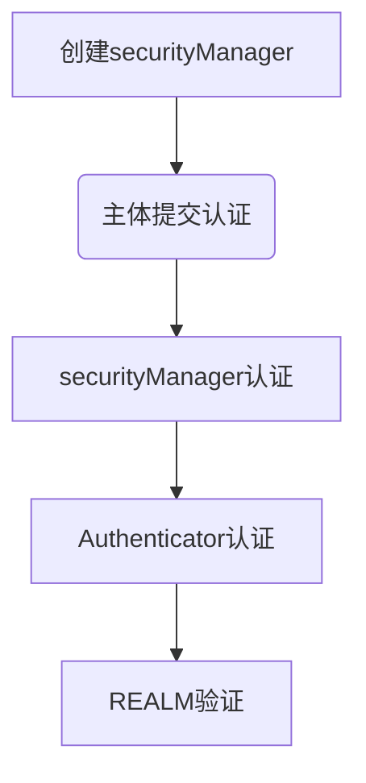
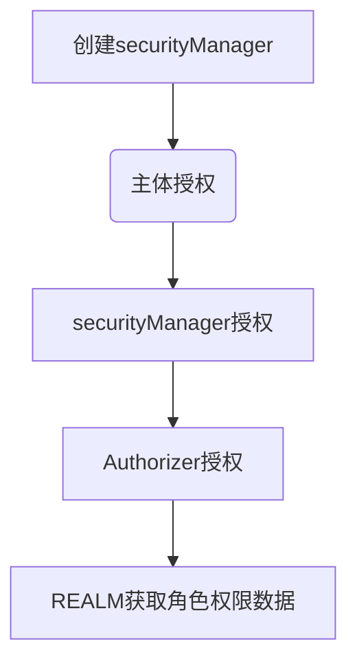

### shiro安全框架

掌握：[官方文档](http://shiro.apache.org/architecture.html) 

认识shiro整体架构，各组件概念

shiro认证及授权过程

shiro自定义的Realm，filter

shiro session管理（使用redis实现分布式session）

shiro 缓存管理 （角色数据和权限数据）

shiro在项目中使用，集成spring

#### 1. 什么是shiro

+ Apache的强大灵活的开源安全框架
+ （可以提供）认证、授权 、企业会话管理 、缓存 、安全加密 --》快捷方便实现项目的权限管理模块开发

#### 2. shiro与spring security比较

| Apache shiro     | spring security  |
| ---------------- | ---------------- |
| 简单 灵活        | 复杂 笨重        |
| 可脱离spring     | 不可脱离spring   |
| 权限控制粒度较粗 | 权限控制粒度更细 |

一般做权限控制基本上是对资源做权限控制，

对数据做权限控制会造成跟业务代码耦合。

spring官方也是使用shiro做安全管理。

#### 3. shiro整体架构

At the highest conceptual level, Shiro’s architecture has 3 primary concepts: 

the `Subject`, `SecurityManager` and `Realms`. 

The following diagram is a high-level overview of how these components interact, and we’ll cover each concept below:


The following diagram shows Shiro’s core architectural concepts followed by short summaries of each:


**Subject** ([`org.apache.shiro.subject.Subject`](http://shiro.apache.org/static/current/apidocs/org/apache/shiro/subject/Subject.html)) --》相当于当前user

**SecurityManager** ([org.apache.shiro.mgt.SecurityManager](http://shiro.apache.org/static/current/apidocs/org/apache/shiro/mgt/SecurityManager.html)) --》the heart of Shiro’s architecture 核心

**Authenticator** ([org.apache.shiro.authc.Authenticator](http://shiro.apache.org/static/current/apidocs/org/apache/shiro/authc/Authenticator.html)) 认证器 （管理登录，登出）

**Authorizer** ([org.apache.shiro.authz.Authorizer](http://shiro.apache.org/static/current/apidocs/org/apache/shiro/authz/Authorizer.html)) 授权器 （赋予主体有哪些权限）

**SessionManager** ([org.apache.shiro.session.mgt.SessionManager](http://shiro.apache.org/static/current/apidocs/org/apache/shiro/session/mgt/SessionManager.html)) session管理器 （shiro自己实现的   	

​		session 管理机制）

+ **SessionDAO** ([org.apache.shiro.session.mgt.eis.SessionDAO](http://shiro.apache.org/static/current/apidocs/org/apache/shiro/session/mgt/eis/SessionDAO.html))  提供session的操作，实现session持久化操作 crud

**CacheManager** ([org.apache.shiro.cache.CacheManager](http://shiro.apache.org/static/current/apidocs/org/apache/shiro/cache/CacheManager.html)) 缓存管理器 （缓存角色数据和权限数据）

**Cryptography** ([org.apache.shiro.crypto.*](http://shiro.apache.org/static/current/apidocs/org/apache/shiro/crypto/package-summary.html))  数据加密

**Realms** ([org.apache.shiro.realm.Realm](http://shiro.apache.org/static/current/apidocs/org/apache/shiro/realm/Realm.html)) --》相当于shiro与数据源（DB）的桥梁

+ Realms act as the ‘bridge’ or ‘connector’ between Shiro and your application’s security data

#### 4. shiro认证过程



​	

#### 5. shiro授权过程




#### 6. shiro自定义realm

##### 6.1 内置realm

+ IniRealm

```java
public class IniRealmTest {

    @Test
    public void auth(){

        // 1 构建securityManager环境
        DefaultSecurityManager defaultSecurityManager = new DefaultSecurityManager();

        IniRealm iniRealm = new IniRealm("classpath:user.ini");

        defaultSecurityManager.setRealm(iniRealm);

        // 2 主体提交认证请求
        SecurityUtils.setSecurityManager(defaultSecurityManager);
        Subject subject = SecurityUtils.getSubject();

        UsernamePasswordToken token = new UsernamePasswordToken("xingfei", "123456");

        subject.login(token);

        System.out.println("isAuthenticated:" + subject.isAuthenticated());

        subject.checkRoles("admin");

        subject.checkPermissions("user:delete","user:update","user:add");
    }
}
```


+ JdbcRealm


```java
public class JdbcRealmTest {

    private DruidDataSource dataSource = new DruidDataSource();

    {
        dataSource.setUrl("jdbc:mysql://localhost:3306/test");
        dataSource.setUsername("root");
        dataSource.setPassword("123456");
    }

    @Test
    public void auth(){

        // 1 构建securityManager环境
        DefaultSecurityManager defaultSecurityManager = new DefaultSecurityManager();

        JdbcRealm realm = new JdbcRealm();

        realm.setDataSource(dataSource);

        String authenticationSql = "select password from dh_user where username = ?";
        realm.setAuthenticationQuery(authenticationSql);

        String roleSql = "select rolename from dh_user_role where username = ?";
        realm.setUserRolesQuery(roleSql);

        String permissionSql = "select permission from dh_role_permission where rolename = ?";
        realm.setPermissionsQuery(permissionSql);

        //默认false未开启权限查找开关
        realm.setPermissionsLookupEnabled(true);

        defaultSecurityManager.setRealm(realm);

        // 2 主体提交认证请求
        SecurityUtils.setSecurityManager(defaultSecurityManager);
        Subject subject = SecurityUtils.getSubject();

        UsernamePasswordToken token = new UsernamePasswordToken("xingfei", "123456");

        subject.login(token);

        System.out.println("isAuthenticated:" + subject.isAuthenticated());

        subject.checkRoles("admin");

        subject.checkPermissions("user:delete","user:update");

    }
}
```


##### 6.2 自定义realm


